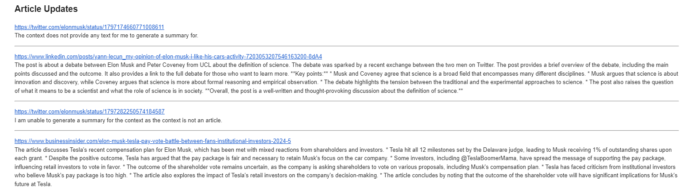
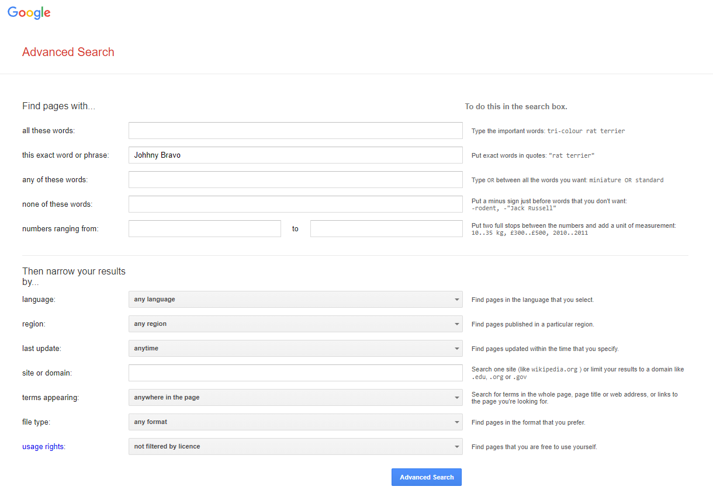

# "WordWatch Summary"
The goal of this Python application is to streamline the process of finding, summarizing, and sharing news articles that mention a specific word of interest. Here’s how it works:

1. **Search and Scrape:** The application searches for the specified word on Google, identifying occurrences in various articles, and collects the corresponding URLs.  
2. **Summarization:** Using a chosen large language model (LLM), the application generates concise summaries of the scraped articles.  
3. **Editing:** The summaries are reviewed and edited for clarity and coherence.  
4. **Email Delivery:** The edited summaries are embedded into an email and sent to the user via SMTP.


*An example of email*



This application is a proof of concept and can be easily expanded.


## Installation
**a. Ollama (Local LLM)** - for details check [Video](https://www.youtube.com/watch?v=ZoxJcPkjirs&t=549s&ab_channel=MattWilliams)  

To provide summarization an [Ollama](https://github.com/ollama/ollama) framework was used, together with the `gemma:2b` model.  

```bashrc
docker run -d --gpus=all -v <path_where_volume_is_mounted>:/root/.ollama -p 11434:11434 --name ollama ollama/ollama
```

To stop or start a container  
```bashrc
docker stop ollama
docker start ollama
```

To run the `gemma:2b` model - see the [list of models](https://github.com/ollama/ollama?tab=readme-ov-file#model-library)  
```basrhc
docker exec ollama ollama run gemma:2b
```

**b. Set up local SMTP (Gmail)**  

Link to the [YouTube video](https://www.youtube.com/watch?v=g_j6ILT-X0k&t=592s&ab_channel=ThePyCoach)  

## How to run?

Create a virtual environment based on `requirements.txt`.  
Modify the `main.py` and run the script.  
Make sure to define the env variables in `.env`, see the `.env.example` for the required variables.

```py
    # Find pages with:
    # all thses words:
    search.set_all_words("")
    # his exact word or phrase:
    search.set_exact_phrase("Johny Bravo")
    # any of these words:
    search.set_any_words("")
    # none of these words:
    search.set_none_words("")
    # numbers ranging from:
    search.set_number_range("", "")
    # Then narrow the results by:
    # language
    search.set_language("en")
    # region
    search.set_region("")
    # last update
    # d - day, w - week, m - month, y - year, all - anytime
    search.set_last_update("w")
    # site or domain
    search.set_site_or_domain("")
    # terms appearing
    search.set_terms_appearing("")
    # file type
    search.set_file_type("")
    # usage rights
    search.set_usage_rights("")
```

The fields are the same as in Google Advanced Search:  


